# Veedu — 3D Real Estate Viewer

A mobile app for exploring real estate properties with interactive 3D models, built with React Native (Expo) and Django REST Framework.

---

## Table of Contents

- [Tech Stack](#tech-stack)
- [Architecture Overview](#architecture-overview)
- [Setup & Installation](#setup--installation)
- [Frontend](#frontend)
  - [File Structure](#frontend-file-structure)
  - [Navigation Flow](#navigation-flow)
  - [Screens](#screens)
  - [Components](#components)
  - [Context Providers (State)](#context-providers)
  - [Hooks](#hooks)
  - [Utils](#utils)
- [Backend](#backend)
  - [File Structure](#backend-file-structure)
  - [Models](#models)
  - [API Endpoints](#api-endpoints)
  - [Utilities](#backend-utilities)
  - [Configuration](#configuration)
- [Data Flows](#data-flows)
  - [Authentication](#authentication-flow)
  - [Property Browsing](#property-browsing-flow)
  - [3D Rendering](#3d-rendering-flow)
  - [Likes System](#likes-flow)
  - [Booking System](#booking-flow)
  - [Location Filtering](#location-filtering-flow)
- [Deployment](#deployment)
- [Environment Variables](#environment-variables)

---

## Tech Stack

| Layer | Technology |
|-------|-----------|
| Mobile App | React Native + Expo (TypeScript) |
| Backend API | Django REST Framework |
| Database | PostgreSQL (Supabase) |
| 3D Rendering | Three.js in WebView |
| File Storage | Supabase S3-compatible bucket |
| Auth | JWT (SimpleJWT) |
| Deployment | Frontend: Expo/EAS · Backend: Render.com |

---

## Architecture Overview

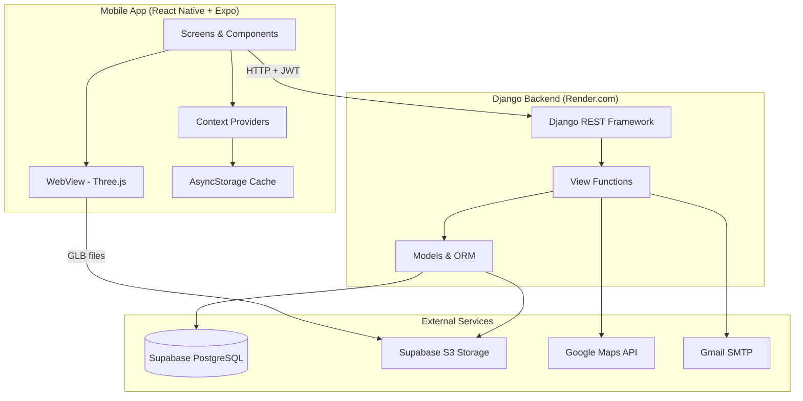

---

## Setup & Installation

### Prerequisites

- Node.js 18+
- Python 3.10+
- PostgreSQL (or Supabase account)
- Expo CLI (`npm install -g expo-cli`)

### Frontend

```bash
cd frontend
npm install          # Install all dependencies
npm start            # Start Expo dev server
npm run android      # Run on Android
npm run ios          # Run on iOS
```

### Backend

```bash
cd backend
pip install -r requirements.txt
python manage.py migrate
python manage.py createsuperuser
python manage.py runserver 0.0.0.0:8000
```

> **Windows note:** Use `venv\Scripts\python` if using a virtual environment.

---

## Frontend

### Frontend File Structure

```
frontend/
├── app/                          # Expo Router (file-based routing)
│   ├── _layout.tsx               # Root layout — AuthProvider wrapper + auth guard
│   ├── index.tsx                 # Entry redirect (→ tabs or login)
│   ├── (auth)/
│   │   ├── _layout.tsx           # Auth stack layout
│   │   └── login.tsx             # Login screen route
│   ├── (tabs)/
│   │   ├── _layout.tsx           # Tab bar layout (Home, Bookings, Profile)
│   │   ├── index.tsx             # Home tab
│   │   ├── bookings.tsx          # Bookings tab
│   │   └── profile.tsx           # Profile tab
│   └── property/[id]/
│       └── index.tsx             # Property detail (dynamic route)
├── screens/                      # Screen implementations
│   ├── Home/index.tsx
│   ├── Login/index.tsx
│   ├── Profile/index.tsx
│   ├── Bookings/index.tsx
│   └── Property/index.tsx
├── components/
│   ├── ThreeDModal/              # Exterior 3D viewer (WebView + Three.js)
│   │   ├── index.tsx
│   │   └── htmlContent.ts        # Three.js HTML generator
│   ├── Interior3DModal/          # Interior 3D viewer + audio tour
│   │   ├── index.tsx
│   │   └── htmlContent.ts
│   ├── BookingModal/index.tsx    # Date/time picker modal
│   ├── LocationModal/index.tsx   # City selection + auto-detect
│   ├── SponsoredCard.tsx         # Horizontal carousel card
│   ├── PropertyListCard.tsx      # Vertical list card
│   ├── HomeHeader.tsx            # Search bar + filters
│   └── HomeStateIndicator.tsx    # Loading/error/empty states
├── contexts/
│   ├── AuthContext.tsx           # JWT auth state management
│   └── LikedViewedContext.tsx    # Likes + viewed properties tracking
├── hooks/
│   ├── useAsyncBackendSync.ts    # Cache-first data sync pattern
│   ├── use-color-scheme.ts
│   └── use-theme-color.ts
├── utils/
│   └── api.ts                    # API base URL + auth fetch helper
└── constants/
    └── theme.ts                  # Colors and fonts
```

---

### Navigation Flow

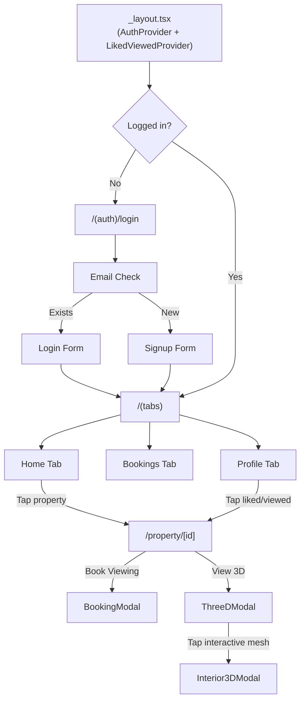

**Tab Bar:** Floating bottom bar with animated icons, BlurView background, 3 tabs (Home, Bookings, Profile).

---

### Screens

#### Login Screen (`screens/Login/index.tsx`)

Step-based auth form with 4 states: `email` → `login` / `signup` / `forgot`.

| Function | What it does |
|----------|-------------|
| `handleCheckEmail()` | POST `/api/check-email/` — routes to login or signup step |
| `handleLogin()` | POST `/api/login/` — stores JWT tokens, updates AuthContext |
| `handleSignup()` | POST `/api/signup/` — sends FormData (email, password, contact, profile pic) |
| `handleForgotPassword()` | POST `/api/forgot-password/` — sends temp password via email |
| `pickImage()` | Opens device image library (expo-image-picker) for profile pic |

---

#### Home Screen (`screens/Home/index.tsx`)

Main property browsing screen with search, filters, and location-based results.

| Function | What it does |
|----------|-------------|
| `fetchAllProperties(coords)` | GET `/api/all-properties/?lat=X&lon=Y` — fetches sponsored + listed |
| `loadLocation()` | Reads cached location from AsyncStorage |
| `handleLocationSelect(city, lat, lon)` | Stores user location preference |
| `handlePropertyPress(property)` | Navigates to `/property/[id]` with JSON params |
| `selectFilter(filter)` | Toggles filter: Villa, Bedroom, Place, Type |

**Filters:**
- **Search** — case-insensitive name/location match
- **Villa** — filters by name/description containing "villa"
- **Bedroom** — sorts by bedroom count (descending)
- **Place** — sorts alphabetically by name
- **Type** — sorts by price (ascending)

---

#### Property Detail Screen (`screens/Property/index.tsx`)

3D viewer + property info with 3 tabs: Overview, Amenities, Trends.

| Function | What it does |
|----------|-------------|
| `handleLike()` | Toggles like via LikedViewedContext |
| `handleBookingConfirm(date, time)` | POST `/api/bookings/` — creates new booking |
| `handleTabChange(tab)` | Animated fade transition between tabs |

**3D Modes:** Exterior (ThreeDModal) ↔ Interior (Interior3DModal), fullscreen toggle.

---

#### Bookings Screen (`screens/Bookings/index.tsx`)

Lists user bookings with tabs: Upcoming / Completed.

| Function | What it does |
|----------|-------------|
| `handleRescheduleConfirm(date, time)` | PUT `/api/bookings/{id}/reschedule/` with optimistic update |
| `handleDirections(link)` | Opens Google Maps / Apple Maps |
| `handleAddToCalendar(booking)` | iOS: expo-calendar event · Android: Google Calendar URL |

Uses `useAsyncBackendSync` hook — loads from cache first, syncs in background.

---

#### Profile Screen (`screens/Profile/index.tsx`)

User profile with 3 tabs: Profile info, Liked properties, Viewed properties.

| Function | What it does |
|----------|-------------|
| `handlePickImage()` | Opens image picker, calls `updateProfile()` |
| `handleUpdateProfile(picUri)` | PUT `/api/profile/update/` — FormData with username, contact, pic |
| `handleChangePassword()` | PUT `/api/change-password/` — returns new JWT tokens |
| `handleLogout()` | Clears all AsyncStorage keys, resets AuthContext |

---

### Components

#### ThreeDModal (`components/ThreeDModal/`)

Renders exterior 3D GLB model in a WebView using Three.js.

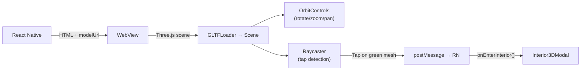

- Highlights meshes listed in `interactive_mesh_names` as green
- Raycasts on tap to detect clicks on interactive meshes
- Distinguishes tap vs drag (prevents orbit from triggering clicks)
- Sends mesh name, position, and bounding box size to React Native console

#### Interior3DModal (`components/Interior3DModal/`)

Renders interior GLB model with camera navigation nodes.

- Camera nodes: predefined positions inside the model for room-by-room navigation
- Navigation buttons: Previous / Next to move between camera nodes
- Audio tour: optional audio playback per node (up to 3 audio URLs)
- Smooth camera transitions between nodes

#### BookingModal (`components/BookingModal/`)

Date and time picker for scheduling property viewings.

- Date: native DateTimePicker (iOS inline, Android dialog)
- Time: 9 slots grid (09:00 AM – 05:00 PM, 1-hour intervals)
- Validates both date and time selected before confirm

#### LocationModal (`components/LocationModal/`)

City selection for distance-based property filtering.

- Auto-detect: uses `expo-location` for GPS + reverse geocoding
- Manual: hardcoded cities (Trivandrum, Kochi, Kollam) with coordinates
- Skip option: dismisses modal, caches preference to never ask again

#### SponsoredCard / PropertyListCard

| Component | Layout | Used In |
|-----------|--------|---------|
| `SponsoredCard` | Full image card (65% screen width) | Horizontal carousel on Home |
| `PropertyListCard` | Thumbnail + info row | Vertical list on Home |

Both support: like toggle with count, property stats (beds/baths/area), press navigation.

---

### Context Providers

#### AuthContext (`contexts/AuthContext.tsx`)

Global authentication state.

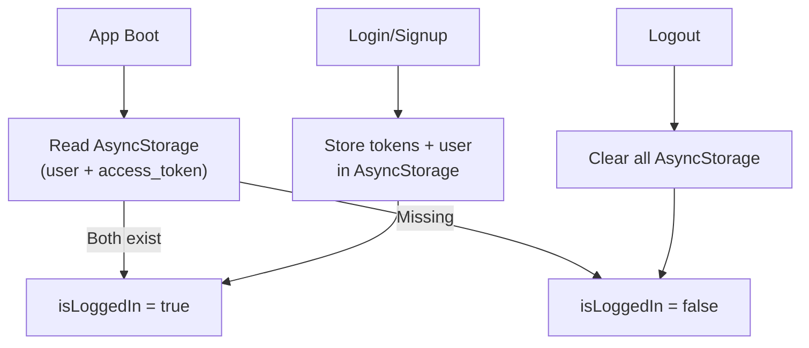

| Export | Type | Purpose |
|--------|------|---------|
| `isLoggedIn` | boolean | Auth state |
| `isLoading` | boolean | True until boot check completes |
| `user` | object | Current user data |
| `setUser(user)` | function | Updates user + persists to AsyncStorage |
| `logout()` | async function | Clears all stored data |

#### LikedViewedContext (`contexts/LikedViewedContext.tsx`)

Tracks liked and viewed properties with optimistic updates.

| Export | Purpose |
|--------|---------|
| `likedIds` | Array of `"source_id"` strings |
| `toggleLike(property, source)` | Optimistic toggle + backend sync |
| `isLiked(id, source)` | Check if property is liked |
| `likedProperties` | Full property objects for liked items |
| `refreshLiked()` | Re-sync from backend |
| `viewedProperties` | Recently viewed properties (max 50) |
| `addViewed(property)` | Add to viewed list |
| `likeCounts` | Map of `"source_id"` → count |
| `seedLikeCounts(properties, source)` | Initialize counts from API response |

**Optimistic Update Strategy:**
1. Immediately update UI (likedIds, likeCounts, likedProperties)
2. Increment mutation version counter
3. Send request to backend (POST/DELETE)
4. If mutation version changed since request started → discard response (UI is fresher)
5. On error → revert to previous state

---

### Hooks

#### `useAsyncBackendSync<T>` (`hooks/useAsyncBackendSync.ts`)

Generic cache-first, background-sync pattern.

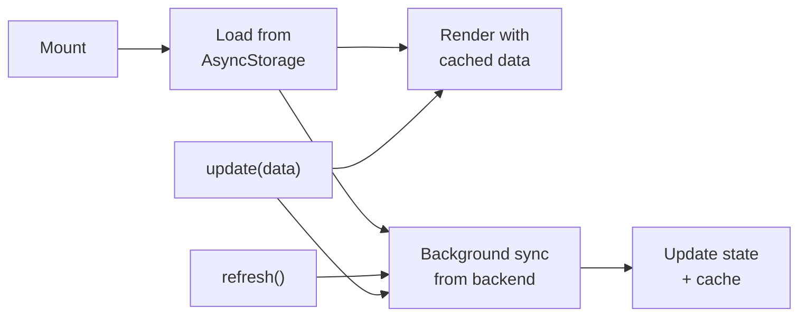

**Used by:** Bookings screen for cache-first booking list.

---

### Utils

#### `api.ts` (`utils/api.ts`)

| Export | Value / Purpose |
|--------|----------------|
| `API_BASE` | `https://realestate3d.onrender.com` |
| `API_URL` | `https://realestate3d.onrender.com/api` |
| `getAuthHeaders()` | Returns `{ Authorization: 'Bearer <token>' }` from AsyncStorage |
| `authFetch(url, options)` | Fetch wrapper that injects auth headers |

---

## Backend

### Backend File Structure

```
backend/
├── config/
│   ├── settings.py        # Django settings (DB, JWT, CORS, S3, email)
│   ├── urls.py             # Root URL config (admin + api/)
│   └── wsgi.py             # WSGI entry point
├── api/
│   ├── models.py           # UserProfile, UserLike, Property, ListedProperty, Booking
│   ├── serializers.py      # DRF serializers for all models
│   ├── urls.py             # API route definitions
│   ├── utils.py            # Geocoding + Haversine distance
│   ├── admin.py            # Django admin registration
│   └── views/
│       ├── auth_views.py   # check_email, login, signup, forgot_password
│       ├── user_views.py   # profile update, likes, change password
│       ├── property_views.py  # Property listing + distance filtering
│       └── booking_views.py   # Booking CRUD + reschedule
└── requirements.txt
```

---

### Models

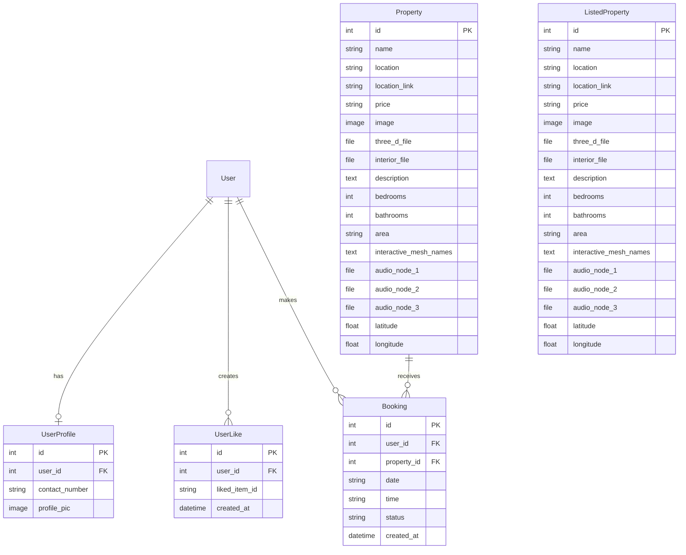

- **Property** = Sponsored/featured properties (shown in horizontal carousel)
- **ListedProperty** = Regular listings (shown in vertical list)
- **UserLike.liked_item_id** format: `"sponsored_<id>"` or `"listed_<id>"` — tracks likes across both tables
- Both Property and ListedProperty auto-extract lat/lon from `location_link` on save

---

### API Endpoints

#### Authentication

| Method | Endpoint | Auth | Throttle | Description |
|--------|----------|------|----------|-------------|
| POST | `/api/check-email/` | No | 20/hr | Check if email exists → routes to login or signup |
| POST | `/api/login/` | No | 10/hr | Returns JWT tokens + user object |
| POST | `/api/signup/` | No | 5/hr | FormData (email, password, contact, pic) → JWT + user |
| POST | `/api/forgot-password/` | No | 5/hr | Sends temp password via Gmail SMTP |
| PUT | `/api/change-password/` | Yes | — | Requires current password, returns new JWT tokens |

#### User

| Method | Endpoint | Auth | Description |
|--------|----------|------|-------------|
| PUT | `/api/profile/update/` | Yes | Update username, contact, profile pic (FormData) |
| POST | `/api/likes/` | Yes | Add like → `{ like_count }` |
| DELETE | `/api/likes/` | Yes | Remove like → `{ like_count }` |
| GET | `/api/liked-properties/` | Yes | Returns `{ liked_ids, properties[] }` with source field |

#### Properties

| Method | Endpoint | Auth | Description |
|--------|----------|------|-------------|
| GET | `/api/all-properties/?lat=X&lon=Y` | No | Returns `{ sponsored[], listed[] }` with distance filtering |
| GET | `/api/properties/?lat=X&lon=Y` | No | Legacy — sponsored only |
| GET | `/api/listed-properties/?lat=X&lon=Y` | No | Legacy — listed only |
| GET | `/api/migrate-coords/` | Admin | Re-extract coordinates for all properties |

#### Bookings

| Method | Endpoint | Auth | Description |
|--------|----------|------|-------------|
| GET | `/api/bookings/` | Yes | All user bookings (sorted newest first) |
| POST | `/api/bookings/` | Yes | Create booking `{ property_id, date, time }` |
| PUT | `/api/bookings/<id>/reschedule/` | Yes | Update date + time (ownership verified) |

---

### View Functions Detail

#### `auth_views.py`

**`check_email(request)`**
- Validates email format, queries User table, returns `{ exists: bool }`

**`login_user(request)`**
- Finds user by email → authenticates with password → ensures UserProfile exists → generates JWT → returns user + tokens

**`signup_user(request)`**
- Validates password (≥6 chars), email uniqueness, optional profile pic (≤5MB, image types only)
- Uses `transaction.atomic()` — User + UserProfile created together (no orphan records)
- Returns same format as login

**`forgot_password(request)`**
- Always returns generic success message (prevents email enumeration)
- Generates 12-char cryptographic password → sends via SMTP → only then updates DB
- If email fails, user's password remains unchanged

**`update_profile(request)`**
- Accepts FormData, updates username/contact/profile pic
- Profile pics get unique filenames: `user_{id}_{timestamp}.{ext}`
- Deletes old profile pic from S3 storage

**`change_password(request)`**
- Verifies current password → sets new password → issues fresh JWT tokens

#### `user_views.py`

**`user_likes(request)`**
- POST: `get_or_create` UserLike → returns like_count
- DELETE: Removes UserLike → returns updated like_count

**`get_liked_properties(request)`**
- Fetches all UserLike for user → resolves each to Property or ListedProperty → serializes with source tag
- Gracefully skips deleted properties

#### `property_views.py`

**`_filter_by_distance(queryset, lat, lon, max_km=20.0)`**
- Helper: filters properties within 20km using Haversine formula
- Attaches `distance_km` to each object, sorts by distance

**`get_all_properties(request)`**
- Fetches all Property + ListedProperty → applies distance filter if lat/lon provided → returns combined response

**`migrate_coords(request)`**
- Admin-only utility to re-extract coordinates from all location_links

#### `booking_views.py`

**`manage_bookings(request)`**
- GET: Returns all user bookings with nested property details
- POST: Creates booking with status='upcoming'

**`reschedule_booking(request, booking_id)`**
- Verifies ownership → updates date + time → returns updated booking

---

### Backend Utilities

#### `utils.py`

**`extract_coords_from_maps_link(url, bias_text=None)`**

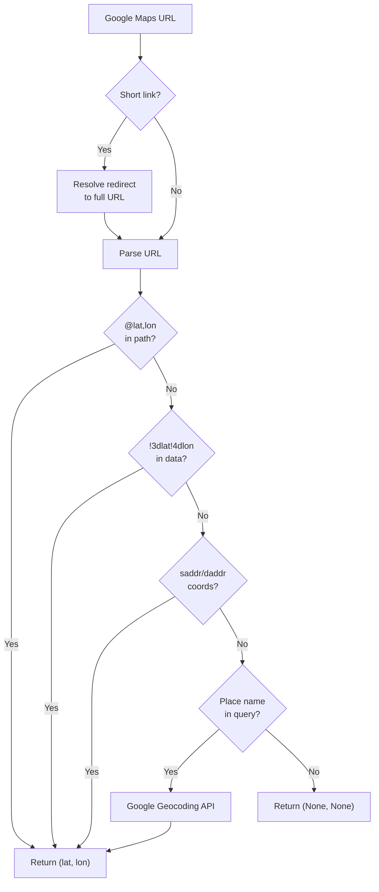

**`calculate_haversine_distance(lat1, lon1, lat2, lon2)`**
- Standard Haversine formula (Earth radius = 6371 km)
- Returns distance in km or None if inputs invalid

---

### Configuration

**JWT:** Access token 7 days, refresh token 30 days, rotation enabled.

**Throttling:** Login 10/hr, check-email 20/hr, forgot-password 5/hr, signup 5/hr.

**Storage:** Supabase S3 bucket `media` — public read, stores images + GLB models + audio files.

**Database:** Supabase PostgreSQL via connection pooler (port 6543, SSL required).

**Email:** Gmail SMTP (TLS on port 587) for password reset.

**CORS:** All origins in debug, restricted to Render domain in production.

---

## Data Flows

### Authentication Flow

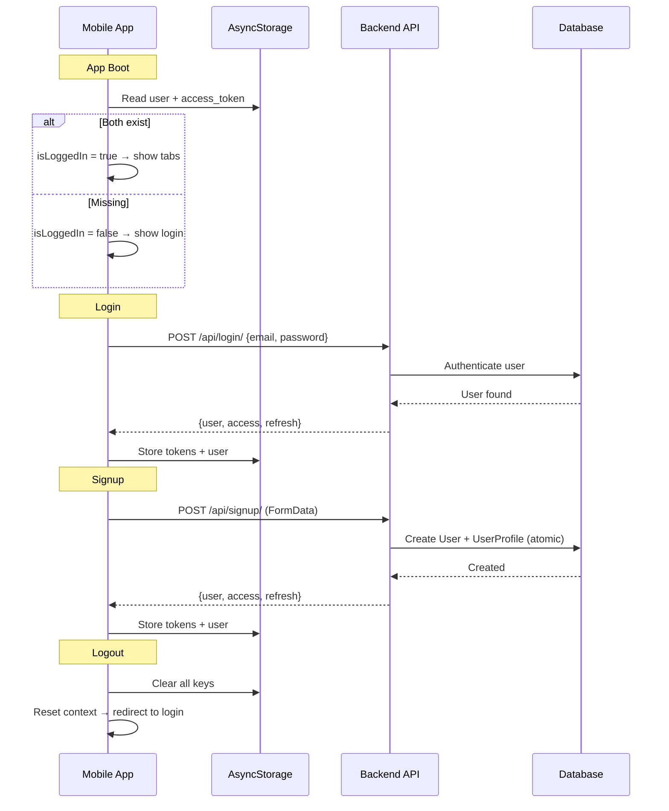

---

### Property Browsing Flow

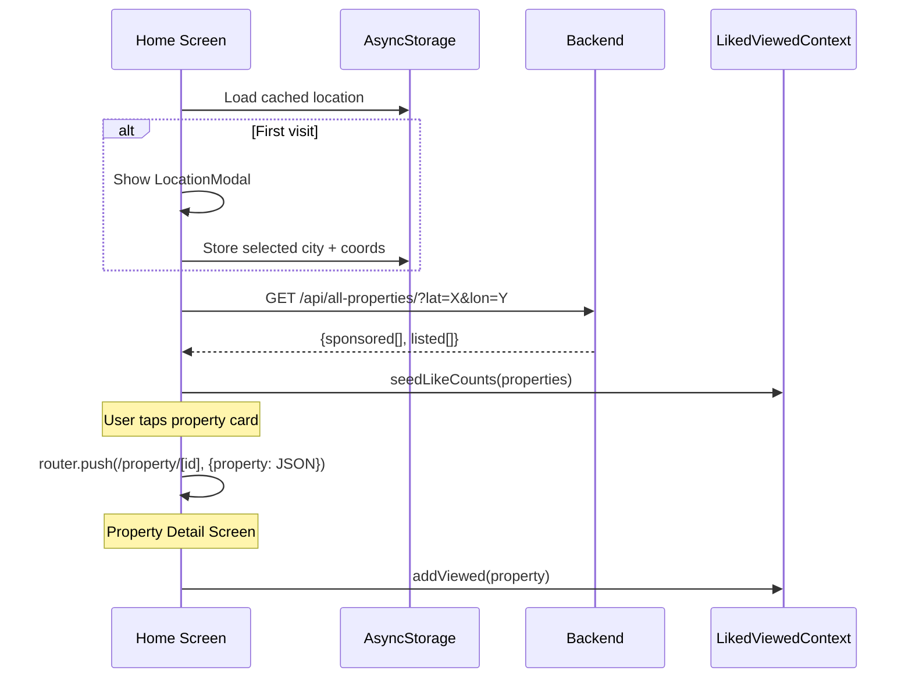

---

### 3D Rendering Flow

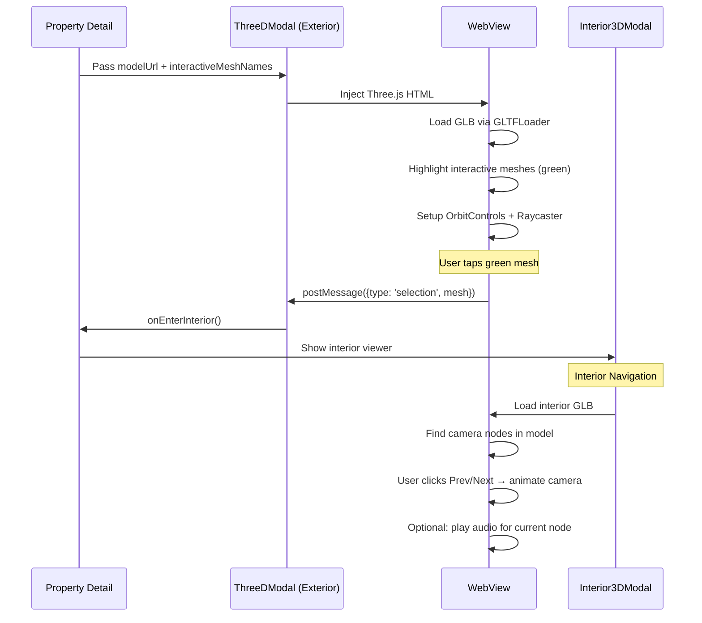

**How interactive meshes work:**
1. Property has `interactive_mesh_names` field (comma-separated, e.g., `"door_1,window_2"`)
2. Three.js traverses the loaded model and colors matching meshes green
3. On tap, raycaster checks if hit mesh is in the interactive list
4. If yes → sends message to React Native → opens interior viewer

---

### Likes Flow

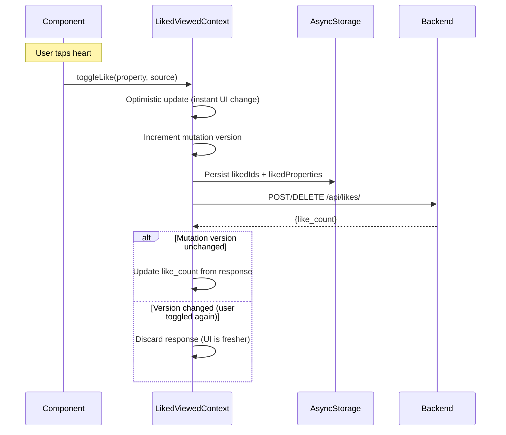

---

### Booking Flow

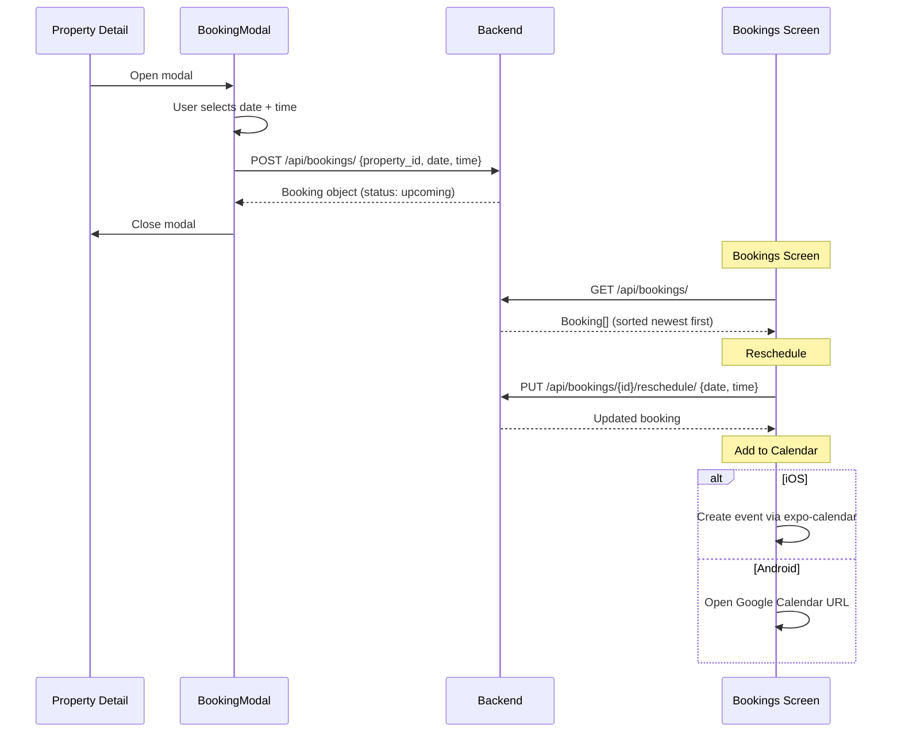

---

### Location Filtering Flow

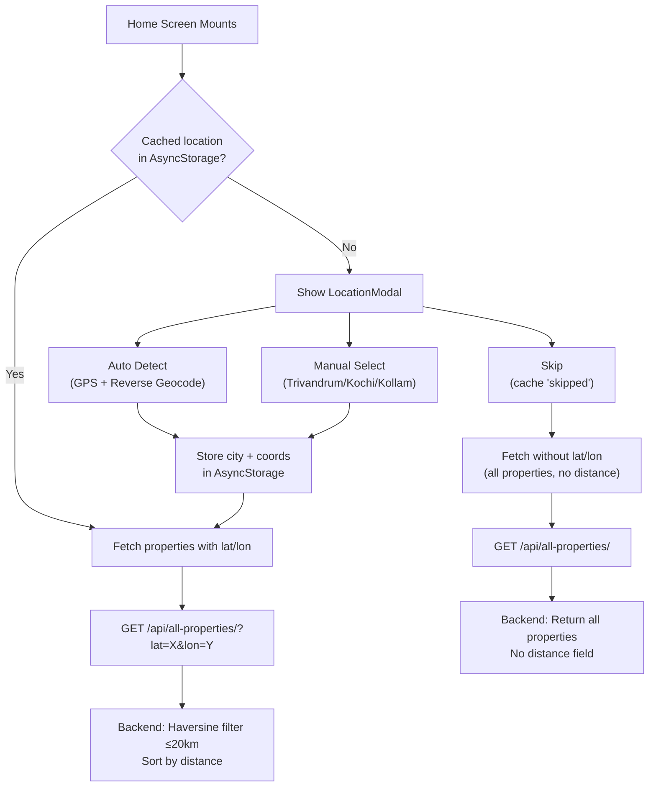

---

## Deployment

### Frontend (Expo/EAS)

```bash
cd frontend
eas build -p android --profile preview    # Android APK
eas build -p ios --profile preview        # iOS build
```

- **App name:** Veedu
- **Package:** `com.kalidas.realestateviewer`
- **Expo slug:** `frontend`

### Backend (Render.com)

- **URL:** `https://realestate3d.onrender.com`
- **Admin:** `https://realestate3d.onrender.com/admin`
- **Static files:** served via Whitenoise middleware
- **Media files:** served from Supabase S3 bucket

---

## Environment Variables

### Backend (`config/settings.py`)

| Variable | Purpose |
|----------|---------|
| `SECRET_KEY` | Django secret key |
| `DEBUG` | Debug mode (default: False) |
| `DB_PASSWORD` | Supabase PostgreSQL password |
| `AWS_ACCESS_KEY_ID` | Supabase S3 access key |
| `AWS_SECRET_ACCESS_KEY` | Supabase S3 secret key |
| `EMAIL_HOST_USER` | Gmail address for SMTP |
| `EMAIL_HOST_PASSWORD` | Gmail app password |
| `GOOGLE_MAPS_API_KEY` | Google Geocoding API key |

### Frontend (`utils/api.ts`)

| Constant | Value |
|----------|-------|
| `API_BASE` | `https://realestate3d.onrender.com` |
| `API_URL` | `https://realestate3d.onrender.com/api` |

For local development, update `API_BASE` to your machine's local IP (e.g., `http://192.168.1.6:8000`).
